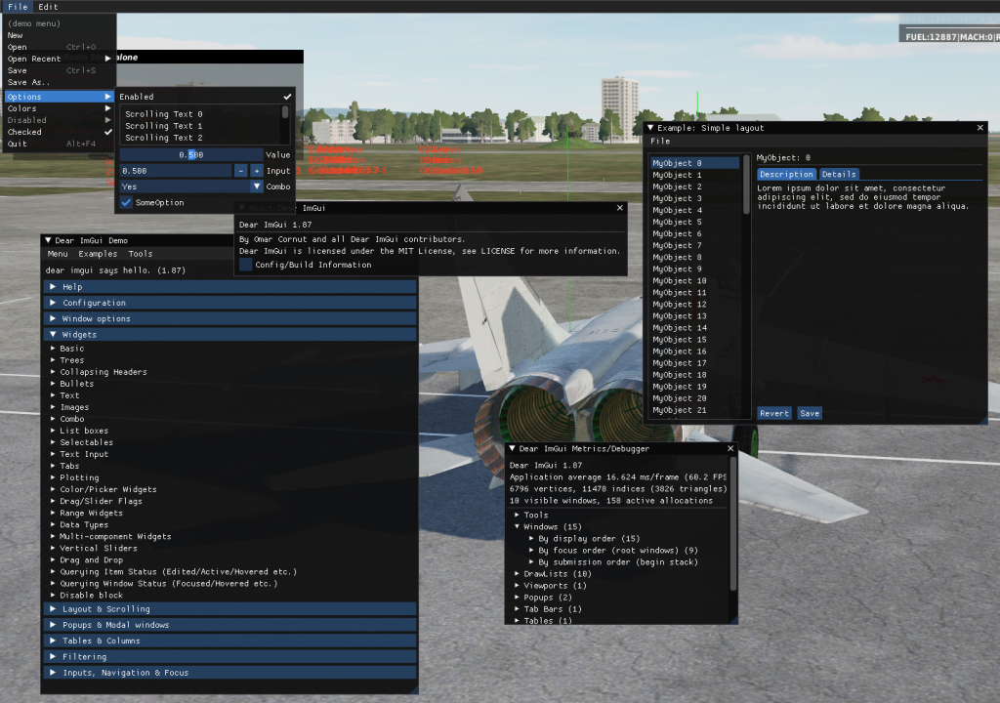
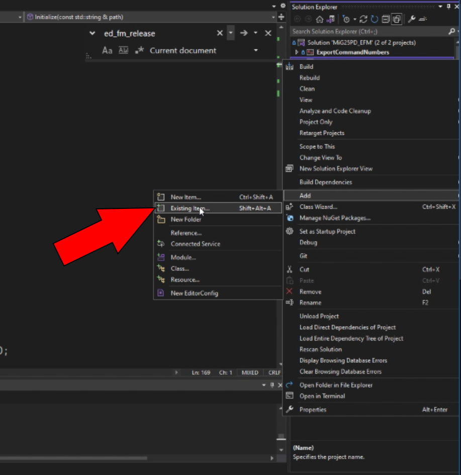
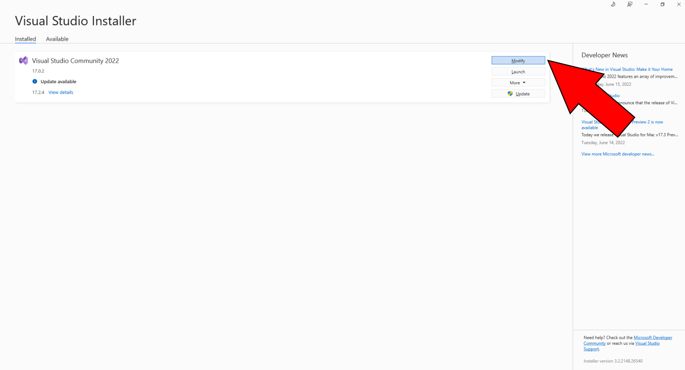
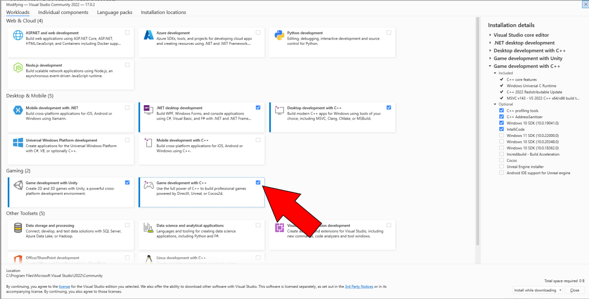

# DCS EFM ImGui (FmGui)

FmGui is a project that implements the Dear ImGui library in the DCS: World EFM
API. Its purpose is to greatly ease the development process of the user's EFM.

# Table of Contents

1. [Building](#building)
2. [Examples](#examples)
3. [Configuration](#config)
4. [Note](#note)
5. [License](#license)

## 1. Building: 
To use the FmGui.hpp and FmGui.cpp source files, they must be included in the
user's EFM Visual Studio or CMake project. In Visual Studio you can add existing
file(s) as seen below.

The user will need to have the
"Desktop development with C++" and "Game development with C++" Visual Studio
workloads installed to successful build these source files. The process for
installing these workloads can be seen below.

The source files use the ImGui and MinHook libraries.

You may find ImGui version 1.87
[here](https://github.com/ocornut/imgui/releases/tag/v1.87), and you can find
MinHook v1.3.3
[here](https://github.com/TsudaKageyu/minhook/releases/tag/v1.3.3).

Including ImGui in your EFM project is really simple. FmGui assumes that you
store the ImGui source files in their original folder and add them to your
project's include path. For example, consider the following folder structure
below.

- EFM
  - lib
    - imgui-1.87
      - imgui
        - imconfig.h
        - imgui.cpp
        - imgui.h
        - imgui_demo.cpp
        - imgui_draw.cpp
        - imgui_impl_dx11.cpp
        - imgui_impl_dx11.h
        - imgui_impl_win32.cpp
        - imgui_impl_win32.h
        - imgui_interal.h
        - imgui_tables.cpp
        - imgui_widgets.cpp
        - imstb_rectpack.h
        - imstb_textedit.h
        - imstb_truetype.h
  - MY_EFM_PROJECT
    - FmGui.hpp
    - FmGui.cpp
    - .vcxproj in this directory.

In Visual Studio select your project in the Solution Explorer and then add the
following entry to *Configuration Properties -> C/C++ -> General -> Additional
Include Directories*: $(ProjectDir)..\lib\imgui-1.87\

As for the MinHook v1.3.3 binary release, assume the same project directory
structure.

- EFM
  - lib
    - MinHook_133_bin
      - bin
        - MinHook.x64.lib
      - include
  - MY_EFM_PROJECT
    - FmGui.hpp
    - FmGui.cpp
    - .vcxproj in this directory.

To add the include directory and link statically for MinHook you can use the
following instructions:

In Visual Studio select your project in the Solution Explorer and then add the
following entry to *Configuration Properties -> C/C++ -> General -> Additional
Include Directories*: $(ProjectDir)..\lib\MinHook_133_bin\include\

Select *Configuration Properties -> Linker -> General -> Additional Libraries
Directories* and add $(ProjectDir)/../lib/MinHook_133_bin/bin/

Select *Configuration Properties -> Linker -> Input -> Additional Dependencies*
and add MinHook.x64.lib

Phew, I think that's everything.

## 2. Examples: 
Checkout the Examples directory for code samples on this library's usage.

See [Examples/Fm.cpp](Examples/Fm.cpp)

For a library reference simply view the FmGui.hpp header file and its
commented functions.

## 3. Configuration: 

Currently there are no real configuration options available, but those will be
added in the future.

## 4. Note: 
Please **do not** use these source files maliciously. This code is meant to
aide the user in developing an EFM with the powerful ImGui widgets library.

These source files were built and tested using Visual Studio Community 2022,
Windows 10 SDK Version 10.0.19041.0, the C++20 Standard, the MinHook library
v1.3.3, the DirectX SDK Version _____, and the ImGui library version 1.87.

## 5. License: 

This project is licensed under the permissive BSD 2-Clause License. For more
details view [LICENSE.txt](LICENSE.txt)
