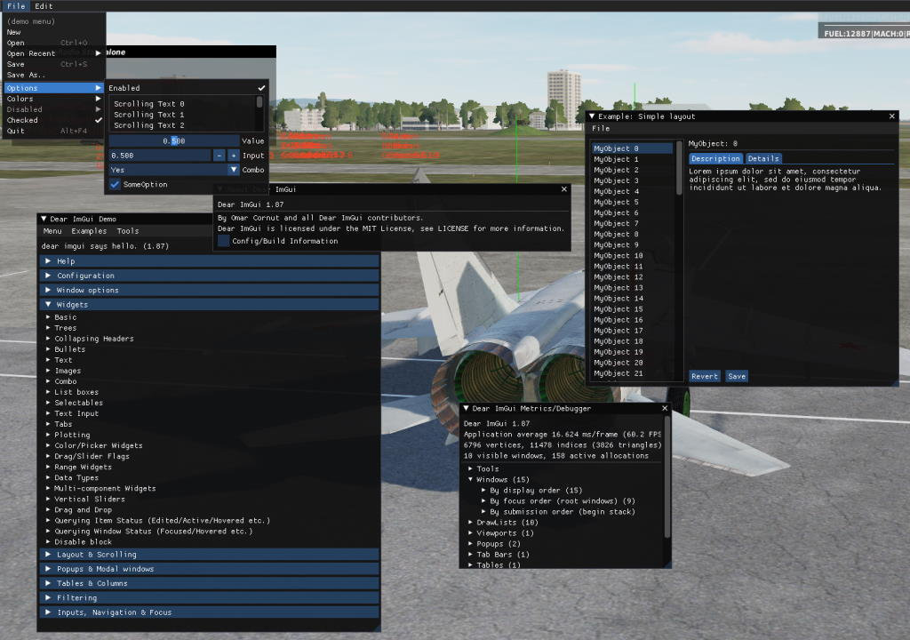
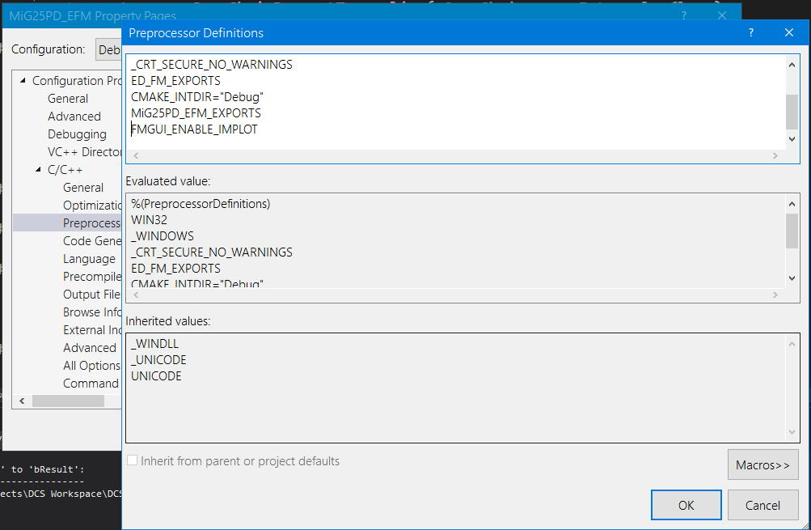

# DCS EFM ImGui (FmGui)

FmGui is a source only library that implements the Dear ImGui library, and optionally the ImPlot extension, for use with the DCS: World EFM API. Its purpose is to greatly ease the development process of the user's EFM.

# Table of Contents

- [1 Setup](#building)
  - [1.1 Setting Up ImGui](#imgui)
  - [1.2 Setting Up ImPlot](#implot)
  - [1.3 Setting Up MinHook](#minhook)
- [2 Examples](#examples)
- [3 Note](#note)
- [4 License](#license)

## 1 Building: 
To use the [Source/FmGui.hpp](Source/FmGui.hpp) and [Source/FmGui.cpp](Source/FmGui.cpp) source files, they must be included in the user's EFM Visual Studio or CMake project. In Visual Studio you can add existing file(s) as seen below.

The user will need to have the "Desktop development with C++" and "Game development with C++" Visual Studio workloads installed to successful build these source files. The "Game development with C++" workload is needed, because it contains the DirectX SDK. The process for installing these workloads can be seen below.

The FmGui source files use the ImGui, ImPlot (optionally), and MinHook libraries.  The required libraries are supplied as submodules of this repository, but you may also wish to retrieve them directly.  You may find ImGui v1.87 [here](https://github.com/ocornut/imgui/releases/tag/v1.87) ImPlot v0.13 [here](t/implot/releases/tag/v0.13), and you can find MinHook v1.3.3 [here](https://github.com/TsudaKageyu/minhook/releases/tag/v1.3.3).

### 1.1 Setting Up ImGui 

Including ImGui in your EFM project is really simple. FmGui assumes that you store the ImGui source files in their original directory and add them to your project's include path. For example, consider the following folder structure below.

- YOUR_EFM/
  - DCS-EFM-ImGui/
    - Lib/
      - imgui/
        - imgui/
          - imconfig.h
          - imgui.cpp
          - imgui.h
          - imgui_demo.cpp
          - imgui_draw.cpp
          - imgui_impl_dx11.cpp
          - imgui_impl_dx11.h
          - imgui_impl_win32.cpp
          - imgui_impl_win32.h
          - imgui_interal.h
          - imgui_tables.cpp
          - imgui_widgets.cpp
          - imstb_rectpack.h
          - imstb_textedit.h
          - imstb_truetype.h
          - ...
      - ...
  - MY_EFM_PROJECT/
    - .vcxproj in this directory.
    - ...
  - .sln in this directory.
  - ...

In Visual Studio select your project in the Solution Explorer and then add the following entry to *Configuration Properties -> C/C++ -> General -> Additional Include Directories*: `$(ProjectDir)..\<REPLACE_THIS>\imgui\`

Since ImGui is distributed in source form you must add the .cpp files to your project as seen earlier. You can also press Shift + Alt + A and select *imgui.cpp*, *imgui_demo.cpp* (not optional), *imgui_draw.cpp*, *imgui_impl_dx11.cpp*, *imgui_impl_win32.cpp*, *imgui_tables.cpp*, and *imgui_widgets.cpp*.

You could also add the header files to your include path, but FmGui assumes the ImGui headers can be found in the current working directory.

### 1.2 Setting Up ImPlot 

ImPlot is an extension for ImGui that adds many useful new widgets such as plots, graphs, charts, and more.

**Note:** The ImPlot dependency is optional.  In order to use ImPlot you need to add the `FMGUI_ENABLE_IMPLOT` preprocessor definition to your build process as shown in the image below.

An ImPlot directory setup might look like this:

- YOUR_EFM/
  - DCS-EFM-ImGui/
    - Lib/
      - implot/
        - implot.cpp
        - implot.h
        - implot_demo.cpp
        - implot_internal.h
        - implot_items.cpp
        - ...
    - ...
  - MY_EFM_PROJECT/
    - .vcxproj in this directory.
    - ...
  - .sln in this directory.
  - ...

In Visual Studio select your project in the Solution Explorer and then add the following entry to *Configuration Properties -> C/C++ -> General -> Additional Include Directories*: `$(ProjectDir)..\<REPLACE_THIS>\implot-0.13\`

Much like ImGui, ImPlot is distributed in the source form so you need to add the *.cpp* files to your project in the same manner. You can press Shift + Alt + A and select *implot.cpp*, *implot_demo.cpp* (not optional), and *implot_items.cpp*.

### 1.3 Setting Up MinHook 

As for the MinHook v1.3.3 release, assume the same project directory structure.

- YOUR_EFM/
  - DCS-EFM-ImGui/
    - Lib/
      - MinHook/
        - lib/
          - libMinHook-v\<Platform Toolset\>-\<Run-time Type\>.x64.lib
        - ...
    - ...
  - MY_EFM_PROJECT
    - .vcxproj in this directory.
    - ...
  - .sln in this directory.
  - ...

I personally recommended using one of the static libraries included in the *MinHook* subdirectory of the FmGui release archive.  You may also build MinHook using the submodule of this repository.  Commit [426cb68](https://github.com/TsudaKageyu/minhook/commit/426cb6880035ee3cceed05384bb3f2db01a20a15) of MinHook added support for Visual Studio 2022.

To add the include directory and link statically for the MinHook static library release you can use the following instructions:

In Visual Studio select your project in the Solution Explorer and then add the following entry to *Configuration Properties -> C/C++ -> General -> Additional Include Directories*: $(ProjectDir)..\<REPLACE_THIS>\MinHook\include\

Select *Configuration Properties -> Linker -> General -> Additional Libraries Directories* and add $(ProjectDir)\..\<REPLACE_THIS>\MinHook\lib\

In the MinHook/lib/ directory of the FmGui release archive, you will see several different static libraries.  Choose the static libraries with the appropriate architecture and platform toolset for your project.  Add these to your different configurations in *Configuration Properties -> Linker -> Input -> Additional Dependencies*.

## 2. Examples: 

Checkout the Examples directory for code samples on this library's usage.

See [Examples/Fm.cpp](Examples/Fm.cpp)

For a library reference simply view the FmGui.hpp header file and its commented functions.

## 3. Note: 

Please **do not** use these source files maliciously. This code is meant to aide the user in developing an EFM with the powerful ImGui widgets library.

These source files were built and tested using Visual Studio Community 2022, Windows 10 SDK Version 10.0.19041.0, the C++20 Standard, the MinHook library v1.3.3, the DirectX SDK Version 1792, and the ImGui library version 1.87.

The minimum C++ ISO Standard requirement for these files is C++11.

## 4. License: 

This project is licensed under the permissive BSD 2-Clause License.  For more details view [LICENSE.txt](LICENSE.txt).  The licenses used by ImGui, ImPlot, and MinHook are included in the release archives of FmGui alongside necessary source files and binaries.

